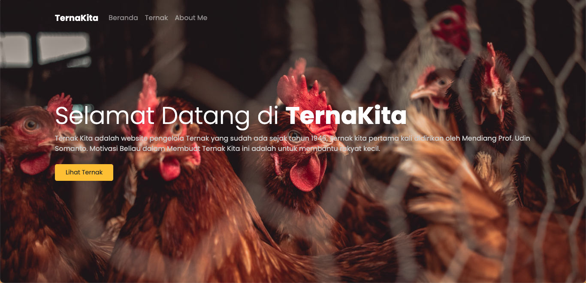

# TernaKita

This is a simple CRUD (Create, Read, Update, Delete) application built using PHP with the MVC (Model-View-Controller) pattern.



## Getting Started

These instructions will get you a copy of the project up and running on your local machine for development and testing purposes.

### Prerequisites

What things you need to install the software and how to install them:

- PHP (version 7.4 or newer)
- MySQL (version 5.6 or newer)
- Web Server (such as Apache, Nginx, etc)

### Installation

1. Clone this repository to your local machine:

```bash
git clone https://github.com/lucifergotmad/ternakita.git
```

2. Navigate to the project folder:

```bash
cd ternakita
```

3. Create a new MySQL database and import the `ternakita_db.sql` file (replace 'database_name' with your database name):

```bash
mysql -u username -p database_name < ternakita_db.sql
```

4. Update the `config.php` file with your database credentials.

5. Start your web server and navigate to the project in your web browser.

### Quick Note

- Make sure you are cloning the project to the folders where your web servers read (Since its using Native PHP)
- If you are using **Nginx** as a Web Server, you would likely need to add more configuration.
  - Since **Nginx** did not support `.htaccess` out of the box we need to do something like this
    - Open up your `nginx.conf`, you can try to search on google. but in my case is in `/opt/homebrew/etc/nginx/nginx.conf`
    - Now on the server block add this specific code

        ```bash
        server {
            //your other config

            location / {
                root   /path/to-your-project;
                index index.php index.html index.htm;
                try_files $uri $uri/ /index.php?url=$uri&$args;
            }

            location ~ \.php$ {
                root            /path/to-your-project;
                fastcgi_pass    127.0.0.1:9000;
                fastcgi_index   index.php;
                fastcgi_param   SCRIPT_FILENAME  $document_root$fastcgi_script_name;
                include         fastcgi_params;
            }

            //your other config
        }
        ```

  - If you get **403 Forbidden Request**, you can try to run this command to update your permissions

    ```bash
    chmod 755 /path/to-your-project
    ```

    This command will give the owner full permissions, and read and execute permissions to the group and others.

### Contributing

If you want to contribute to this project and make it better, your help is very welcome.

Build with passion by  @lucifergotmad
